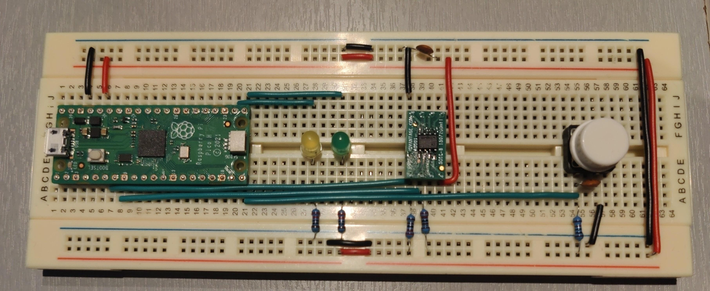
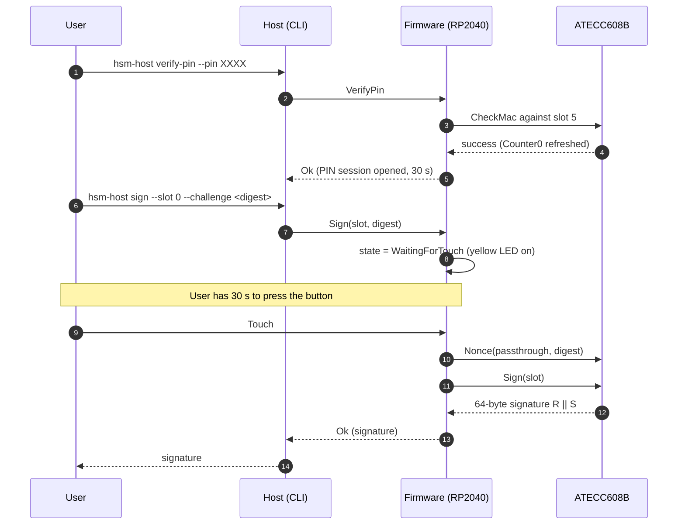

# pico-hsm-rs

[](https://github.com/0xethamin/pico-hsm-rs/actions/workflows/ci.yml)
[](https://0xethamin.github.io/pico-hsm-rs/)
[](LICENSE)

Open-source USB security token (mini HSM) on the Raspberry Pi Pico
(RP2040) and Microchip ATECC608B secure element. ECDSA P-256 with
hardware-enforced PIN and touch-to-sign, designed for smart-lock
authentication. no_std Rust workspace, with the full ATECC608B driver,
bring-up tooling, and host CLI included.



## What it does

The token holds an ECDSA P-256 private key generated on-chip and never
extractable. Every signature requires two factors:

1. A **PIN** verified hardware-side by the ATECC608B through a
   `CheckMac` operation against a dedicated slot. The chip enforces the
   retry limit (5 attempts per batch), so brute-forcing over USB is
   physically impossible.
2. A **physical touch** on the device's button, with a 30 s window per
   signature. No signature can be issued without a fresh touch, even
   inside an active PIN session.

If the PIN is forgotten, a one-time PUK generated at provisioning resets
the PIN counter. The PUK itself is rate-limited (10 attempts per batch).
After both counters are exhausted, an emergency reset regenerates the
ECC keys and resets the PIN to default.

## How a signature happens



## Features

- **no_std ATECC608B driver** with a generic async HAL trait. Wake / idle
  protocol enforced at compile time through a type-state `Atecc` /
  `AteccChannel<'_>` pair, so the borrow checker rejects calls on an
  asleep chip.
- **Hardware-verified PIN** through `CheckMac`. The host implementation
  is validated against the CryptoAuthLib C reference with three oracle
  test vectors (uniform, linear, realistic).
- **Touch-to-sign** with a debounced GPIO button, 30 s window, and full
  state-machine separation: the touch task only signals an intent, the
  signing path explicitly waits for it.
- **Encrypted slot updates** for PIN, PUK, and ECC private key import,
  via the slot 8 I/O Protection master key. The master key itself is
  pure RNG output from the chip, never derived, never persisted in
  firmware.
- **Counter-encoded factory state**: the ATECC's monotonic counters are
  initialised via an exact 8-byte encoding that produces `count = 0`,
  documented in `tools/config-generator/src/counter_encoding.rs` with
  eight reference vectors. The naive `0xFF * 8` initialisation that
  bricks fresh chips is the first thing tested against.
- **Host-testable firmware** through a separate `hsm-firmware-logic`
  crate (state machine, button debouncer, LED patterns) that the
  RP2040-specific `hsm-firmware` binary plugs hardware into.

## Quick start

Assumes a fully assembled board (see [Hardware](#hardware) below) and a
chip that has gone through the [bring-up
procedure](docs/bring-up-procedure.md).

```bash
# 1. Build the host CLI
cargo build -p hsm-host --release

# 2. Flash the firmware to the Pico (Pico in BOOTSEL mode)
cargo firmware-run

# 3. Plug the dongle in via USB. Confirm it is enumerated.
hsm-host info

# 4. Open a PIN session
hsm-host verify-pin --pin 0000

# 5. Sign a 32-byte digest. The yellow LED lights up; touch the button.
hsm-host sign --slot 0 --challenge $(openssl rand -hex 32)
```

A full walk-through from a sealed-bag ATECC608B to a working token, with
provisioning and lock procedures, is in
[`docs/bring-up-procedure.md`](docs/bring-up-procedure.md).

## Hardware

Bill of materials for one prototype on a solderless breadboard:

| Qty | Component                                              |
|-----|--------------------------------------------------------|
| 1   | Raspberry Pi Pico H (RP2040, headers pre-soldered)     |
| 1   | Micro-USB to USB-A cable (host link)                   |
| 1   | ATECC608B-SSHDA secure element (SOIC-8)                |
| 1   | SOIC-8 to DIP-8 adapter board                          |
| 2   | 2.2 kOhm resistors (I2C SDA / SCL pull-ups)            |
| 1   | Green LED (idle / authenticated indicator)             |
| 1   | Yellow LED (waiting-for-touch / signing indicator)     |
| 2   | 220 Ohm resistors (one per LED)                        |
| 1   | Momentary push button                                  |
| 1   | 10 kOhm resistor (button pull-down)                    |
| 2   | 100 nF ceramic capacitor (decoupling + button RC filter)|
| 1   | Breadboard                                             |

The Pico GPIO mapping is documented inline in
[`crates/hsm-firmware/src/hal_rp2040.rs`](crates/hsm-firmware/src/hal_rp2040.rs).
SDA is GP4, SCL is GP5, the button is on GP15, and the LEDs are on GP13
(green) and GP14 (yellow).

## Repository layout

```
pico-hsm-rs/
|-- crates/
|   |-- atecc608b/          # no_std driver for the ATECC608B, generic over a HAL trait.
|   |-- hsm-crypto-service/ # Business logic: slot conventions, sign workflow, PIN / PUK verification.
|   |-- hsm-usb-protocol/   # HID command / response encoding, shared between firmware and host CLI.
|   |-- hsm-firmware-logic/ # Host-testable parts of the firmware (state machine, button debouncer).
|   |-- hsm-firmware/       # The firmware binary for RP2040. Links the other crates together.
|-- tools/
|   |-- hsm-host/           # CLI utility on the host PC to talk to the token over USB-HID.
|   |-- config-generator/   # Produces the 128-byte ATECC608B configuration zone blob.
|-- docs/                   # Design documents, bring-up procedure, protocol spec.
```

Layered dependencies: each crate may only depend on the one directly
below it. The split is enforced physically, not by convention. See
[`docs/architecture.md`](docs/architecture.md) for the full breakdown.

## Documentation

- **Online rustdoc** with private items included:
  [0xethamin.github.io/pico-hsm-rs](https://0xethamin.github.io/pico-hsm-rs/)
- [Architecture overview](docs/architecture.md): layered breakdown, slot
  allocation, threat model, state machine.
- [USB-HID protocol](docs/usb-hid-protocol.md): wire format, opcodes,
  response codes, sample exchanges.
- [Configuration zone layout](docs/config-zone-layout.md): every byte
  of the ATECC608B configuration zone explained, with field references
  to CryptoAuthLib.
- [Bring-up procedure](docs/bring-up-procedure.md): step-by-step from a
  sealed-bag chip to a working token, with explicit exit criteria.
- [CheckMac validation](docs/checkmac-validation.md): how the host-side
  hash formula was validated against the chip's actual response.

## Build and test

```bash
# Host-side unit and integration tests (no hardware required):
cargo test

# Firmware cross-compiled for thumbv6m-none-eabi:
cargo firmware-build

# Firmware flashed to a Pico in BOOTSEL mode:
cargo firmware-run

# Host CLI:
cargo build -p hsm-host --release

# Documentation, with private items, mirroring the CI build:
cargo doc --no-deps --document-private-items
```

The workspace has `default-members` set so a bare `cargo` command does
not try to compile the firmware crate for the host target. Use the
`firmware-build` / `firmware-check` / `firmware-run` aliases, defined in
`.cargo/config.toml`, to operate on the firmware.

## Non-goals and possible follow-ups

The project is **production-grade as a hobby reference**, not as a
shipping product. A few directions exist for whoever wants to take it
further:

- **Attestation certificates.** Slot 10 is reserved in a polyvalent ECC
  configuration so an attestation chain could be added without redoing
  the configuration zone. Would let third parties verify a signature
  was produced by a genuine pico-hsm-rs token, not a clone.
- **Secure firmware updates.** The Pico is flashed via the BOOTSEL
  button. A signed-firmware update path would let the token be
  reflashed in the field without disassembly and without trusting the
  user's host machine.
- **Hardware tamper detection.** The dongle has none. A simple mesh or
  enclosure switch would raise the cost of physical attack from
  "desolder the chip" to "destroy the device in the process".
- **Hardware-backed PIN session.** The 30 s session is enforced by the
  firmware. A TempKey-lifecycle-backed approach on the chip itself
  would survive a firmware-state compromise (today, a firmware bug
  could in theory extend a session).

If you do any of these, please file an issue or open a PR. I would
love to hear what you ended up doing.

## About this project

Built for the **Maker Days 2026** hackathon at Garage Isep. The
hackathon was the trigger, but the goal from the start was to produce
code that holds up to a real review: type-state where it earned its
keep, host-testable layers, oracle vectors against CryptoAuthLib for
the cryptographic bits, and a documented bring-up procedure that a
stranger could follow.

That said: this is a personal project, not a maintained library. I
will respond to issues and PRs as time allows, but I do not commit to
a release cadence, a stability policy, or feature requests. If you
need a HSM you can build a product around, you probably want a
YubiHSM, a Nitrokey HSM, or to fork this and own the maintenance
yourself.

The `atecc608b` driver may be published to crates.io as a standalone
crate at some point, since it is the most reusable piece of the
project. If that happens, it will be tagged and the README updated.

## License

This entire workspace, including the firmware, the host tools, and the
ATECC608B driver, is open-source and licensed under the **GNU General
Public License v3.0 or later**
([GPL-3.0-or-later](LICENSE)).

This strong copyleft license ensures that any modifications,
improvements, or products built upon this project remain open-source and
freely available to the community.

### Commercial licensing

If you wish to integrate this project, whether it's the HSM firmware
logic, the architecture, or the driver, into a proprietary,
closed-source commercial product (and therefore cannot comply with the
GPLv3 requirement to open-source your entire product), please contact
me to discuss a **Commercial License**.

Contact: `perso@simontuloup.fr`